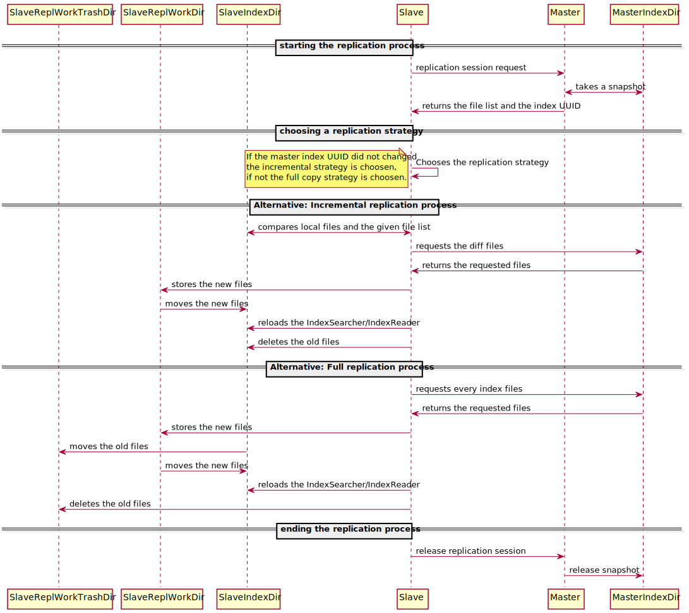

Replication sequence
====================

This diagram describes the replication process used by QWAZR during a slave/master index replication.

The replication process is lock-less. While the replication is running, it is still possible to write in the master,
and read on both slave and master.

{:class="img-fluid"}
