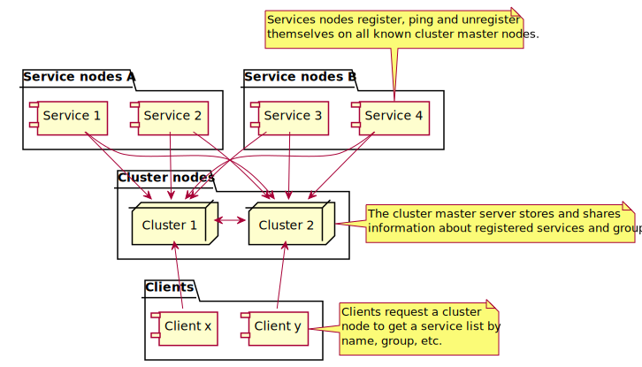
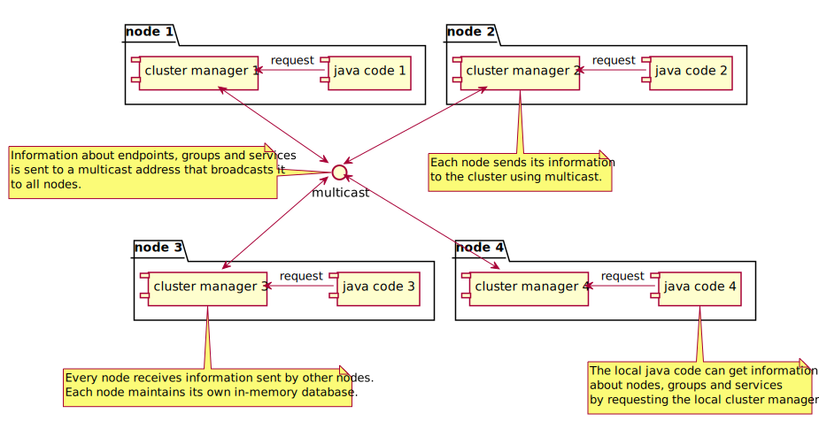

QWAZR Cluster
=============

**Qwazr Cluster** is a JAVA library for distributed systems. It collects, maintains and provides information about those services available in the cluster.

The core ideas are:
- **Services** register in the **cluster** using UDP datagram messages.
- The **cluster** shares this information with its every member **service**.
- **Clients** query the **cluster** to learn the **endpoints** of existing services.
- **Clients** can then directly contact these **services** through said **endpoints**.

_The cluster master servers do not know anything about how to contact a service. Neither do they function as a proxy or a load balancer. It is up to the **client** to work with the provided endpoints._

The QWAZR Cluster service can be used either:
- As a **stand-alone JSON Web service:**
It exposes a JSON Web service APIs set. For more about this, see [Web Service JSON](json-web-service).
- **Embedded in a JAVA application:**
The library manages the UDP network connections, using its ClusterManager component. Queries can also be done in JAVA. For more about this, see [JAVA library](java-library).

How does it work?
-----------------

{:class="img-fluid"}

### List of actors

#### Service
 
This is typically a JAVA program instance. It registers in the cluster using the QWAZR Cluster library. 

A service's attributes are:
- **Its generic service name**: Which describes the kind of service provided by the instance.
- **Its groups list**:  The groups this service belongs to.
- **Its public endpoint**: The hostname and the port that clients will use to contact this service.

#### Cluster node

A QWAZR Cluster instance (ClusterManager) that is in charge of sharing information about available services.

Every ClusterManager instance communicates its services-related information using datagram (UDP) messages.

#### Client

A cluster client is any program requesting information about existing services and their endpoints. The client can then use this data to work directly with these services.

### Network communication

Two modes are provided:
- One based on the [Multicast procotol](https://en.wikipedia.org/wiki/Multicast). For more about this, see [Cluster Multicast](multicast-cluster).
- The other based on **master nodes**. For more about this, see [Cluster Masters](masters-cluster).

#### Using multicast

The cluster nodes automatically share information about their services by broadcasting to a multicast address.

{:class="img-fluid"}

#### Using master nodes
 
The cluster nodes automatically register themselves to a set of master nodes. This is done through a pre-configured list. Information is exchanged between nodes using the UDP protocol [datagram protocol](https://en.wikipedia.org/wiki/User_Datagram_Protocol).
