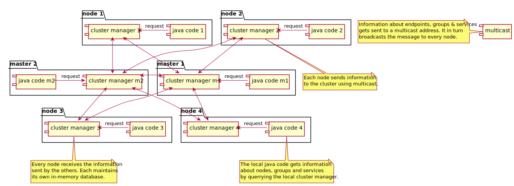
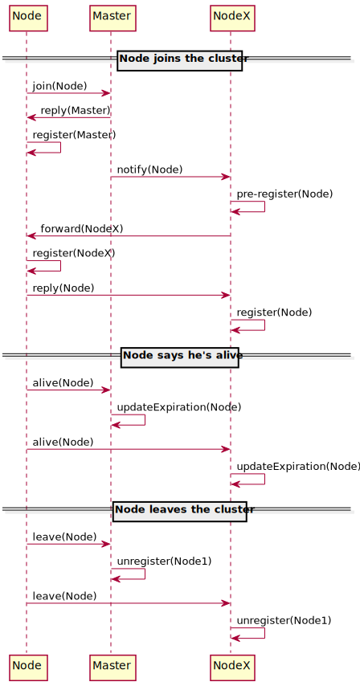

Cluster avec Masters
====================
 
Principe général
----------------

Les services s'enregistrent auprès de noeuds Masters, dont le rôle est de collecter et maintenant la liste des noeuds
présents dans le cluster et d'assurer la transmission des échanges entre le noeuds.

{:class="img-fluid"}

Diagramme de séquence
---------------------

Ce diagramme de séquence explique quels messages sont échangés entre les noeuds du cluster pour ces 3 scénarios:

- Lorsque qu'un service s'inscrit sur le cluster (join)
- Lorsque qu'un service signifie qu'il est toujours fonctionel (alive)
- Lorsque qu'un service se désinscrit (leave)

{:class="img-fluid"}

- A gauche l'acteur "Node" représente le noeud qui s'inscrit.
- Au milieu, l'acteur "master" réprésente le ou les noeuds masters.
- A droite, l'acteur "NodeX" répresente un ou plusieurs noeuds déjà présente dans le cluster
