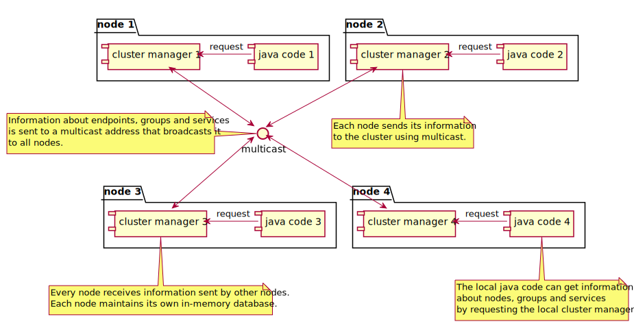
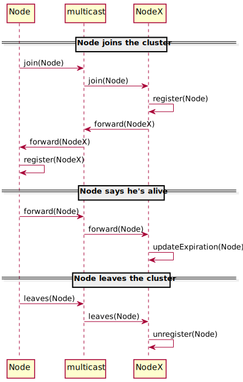

Cluster Multicast
=================

Principe général
----------------

Dans ce mode de fonctionnement, le Cluster utilise les caractéristiques de diffusion offert par le mécanisme Multicast
[multicast](https://fr.wikipedia.org/wiki/Multicast).

Chaque noeud du cluster communique avec l'ensemble du cluster en écrivant vers une adresse multicast qui est
automatiquement diffusé à l'ensemble des autres noeuds.

{:class="img-fluid"}

Diagramme de séquence
---------------------

Ce diagramme de séquence explique quels messages sont échangés entre les noeuds du cluster pour ces 3 scénarios:

- Lorsque qu'un service s'inscrit sur le cluster (join)
- Lorsque qu'un service signifie qu'il est toujours fonctionel (alive)
- Lorsque qu'un service se désinscrit (leave)

{:class="img-fluid"}

- A gauche l'acteur "Node" représente le noeud qui s'inscrit.
- Au milieu, l'acteur "multicast" réprésente la couche réseau.
- A droite, l'acteur "NodeX" répresente un ou plusieurs noeuds déjà présente dans le cluster.
