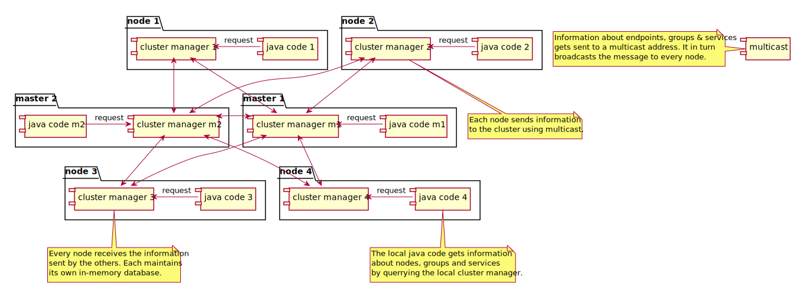

Masters cluster
===============
 
The cluster nodes register themselves to a set of master nodes. These registrations are done using a pre-configured list.

{:class="img-fluid"}

{:class="img-fluid"}
